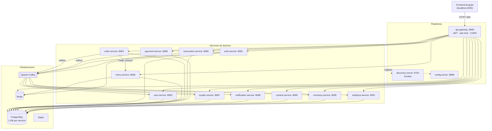
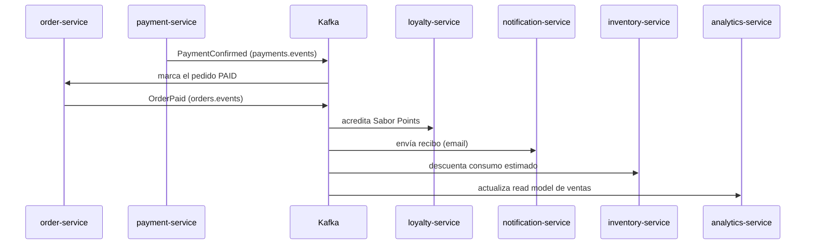

# Sabor Mayor — Backend

Backend de **microservicios** para *Sabor Mayor*, restaurante de alta cocina latinoamericana.
Java 17 · Spring Boot 3.3 · Spring Cloud 2023 · PostgreSQL (database-per-service) · Redis · Kafka · WebSockets · Flyway · JWT/OAuth2 · Docker.

El frontend (Angular) lo desarrolla otro equipo; este repositorio entrega **APIs REST, eventos de dominio, WebSockets de tiempo real y la infraestructura de soporte**.

---

## Arquitectura



### Comunicación entre servicios

- **Frontend → gateway**: punto único de entrada. El gateway valida el JWT, aplica rate limiting (Redis) y CORS.
- **Síncrona (Feign + Resilience4j)**: sólo cuando es imprescindible. Ej.: `order-service` consulta precios y disponibilidad a `menu-service` (con circuit breaker).
- **Asíncrona (Kafka, preferida)**: eventos de dominio. `order-service` y `payment-service` usan el **patrón outbox** para fiabilidad.
- **Tiempo real (STOMP/SockJS)**: `order-service` expone WebSockets para el Kitchen Display System y la app del mesero.

### Tópicos Kafka

`orders.events` · `payments.events` · `reservations.events` · `users.events`

### Flujos de eventos clave



- **`OrderPaid`** → loyalty (puntos) + notification (recibo) + inventory (consumo) + analytics (ventas).
- **`ReservationCreated`** → notification (email/WhatsApp) + recordatorio programado 24h antes (`ReservationReminderDue`).
- **`OrderStatusChanged`** → WebSocket a cocina/mesero/cliente + notification (push).

---

## Puesta en marcha

### Opción A — Todo con Docker Compose (recomendada)

```bash
cd sabor-mayor-backend
cp .env.example .env          # opcional: ajusta credenciales/integraciones
mvn clean package -DskipTests # genera los JAR que copian los Dockerfile
docker compose up --build
```

Levanta PostgreSQL (con una DB por servicio), Redis, Kafka (KRaft), Zipkin y los 14 servicios.
Espera a que `discovery-server`, `config-server` y `auth-service` estén *healthy*; el resto arranca en cascada.

- Gateway: <http://localhost:8080>
- Eureka: <http://localhost:8761>
- Zipkin: <http://localhost:9411>
- Swagger por servicio: `http://localhost:<puerto>/swagger-ui.html`

### Opción B — Un servicio aislado para desarrollo

Cada microservicio arranca solo con sus defaults locales (Postgres/Redis/Kafka en localhost):

```bash
# infraestructura mínima
docker compose up -d postgres redis kafka zipkin discovery-server config-server
# un servicio concreto
mvn -pl auth-service spring-boot:run
```

### Requisitos

Java 17 · Maven 3.9+ · Docker 24+. Los tests de integración usan **Testcontainers** (requieren Docker).

---

## Usuarios semilla (dev)

| Rol | Email | Password |
|-----|-------|----------|
| SUPER_ADMIN | superadmin@sabormayor.com | `Admin123!` |
| ADMIN | admin@sabormayor.com | `Admin123!` |
| MESERO | mesero@sabormayor.com | `Mesero123!` |
| COCINERO | cocinero@sabormayor.com | `Cocina123!` |
| CLIENTE | cliente@sabormayor.com | `Cliente123!` |

La carta completa (entradas, fuertes, postres, cócteles, vinos), las mesas con QR y el horario de reservas también vienen sembrados vía Flyway.

---

## Servicios y endpoints principales

> Todo se consume a través del gateway en `http://localhost:8080`. Los `GET` públicos no requieren token.

### Plataforma

| Servicio | Puerto | Rol |
|----------|--------|-----|
| discovery-server | 8761 | Eureka (registro/descubrimiento) |
| config-server | 8888 | Configuración centralizada (`config-repo/`) |
| api-gateway | 8080 | Entrada única, JWT, rate limit, CORS |

### auth-service (8081)

| Método | Ruta | Acceso |
|--------|------|--------|
| POST | `/api/auth/register` | público |
| POST | `/api/auth/login` | público |
| POST | `/api/auth/refresh` | público (rotación de refresh) |
| POST | `/api/auth/oauth2/{provider}` | público (Google/Apple; mock en dev) |
| POST | `/api/auth/logout` | autenticado |
| GET / DELETE | `/api/auth/me` | autenticado (DELETE = Habeas Data) |
| POST | `/api/auth/staff` | ADMIN / SUPER_ADMIN |
| GET | `/.well-known/jwks.json` | público (clave de verificación JWT) |

### user-service (8082)

| Método | Ruta | Acceso |
|--------|------|--------|
| GET / PUT | `/api/users/me` | autenticado |
| GET/POST/PUT/DELETE | `/api/users/me/addresses` | autenticado |
| GET/POST/DELETE | `/api/users/me/payment-methods` | autenticado (sólo tokens) |
| GET | `/api/users` · `/api/users/{id}` | ADMIN / MESERO |
| GET / PUT | `/api/staff` | ADMIN / SUPER_ADMIN |

### menu-service (8083)

| Método | Ruta | Acceso |
|--------|------|--------|
| GET | `/api/menu/categories` · `/api/menu/dishes` · `/api/menu/dishes/{slug}` | público (caché Redis) |
| POST/PUT/PATCH/DELETE | `/api/menu/admin/dishes/**` · `/categories/**` | ADMIN |
| GET | `/api/menu/admin/margins` | ADMIN (precio/costo/margen) |

### order-service (8084)

| Método | Ruta | Acceso |
|--------|------|--------|
| GET/POST/DELETE | `/api/cart/**` | autenticado |
| POST | `/api/orders` | autenticado (dine-in/delivery/pickup) |
| GET | `/api/orders/me` · `/api/orders/{id}` | autenticado |
| PATCH | `/api/orders/{id}/status` | staff (máquina de estados) |
| GET | `/api/orders/{id}/split` | staff (split de cuenta) |
| GET/PATCH | `/api/kitchen/**` | COCINERO (KDS) |
| GET/POST/PATCH | `/api/tables/**` | staff / público (`by-qr`) |
| WS | `/ws` → `/topic/kitchen`, `/topic/waiter`, `/topic/orders/{id}` | tiempo real |

### reservation-service (8085)

| Método | Ruta | Acceso |
|--------|------|--------|
| GET | `/api/reservations/availability` | público |
| POST | `/api/reservations` | autenticado (depósito si 8+) |
| GET | `/api/reservations/me` | autenticado |
| DELETE | `/api/reservations/{id}` | dueño / staff |
| GET/PATCH | `/api/reservations` · `/{id}/status` | staff |
| POST | `/api/reservations/blocked-dates` | ADMIN |

### payment-service (8086)

| Método | Ruta | Acceso |
|--------|------|--------|
| POST | `/api/payments` | autenticado (mock gateway en dev) |
| POST | `/api/payments/{id}/refund` | ADMIN (parcial/total) |
| GET | `/api/payments/me` · `/{id}` · `/by-order/{id}` | autenticado / staff |

### loyalty-service (8087)

| Método | Ruta | Acceso |
|--------|------|--------|
| GET | `/api/loyalty/me` · `/me/transactions` | autenticado |
| POST | `/api/loyalty/me/redeem` | autenticado |

Niveles: Alumno Culinario → Cocinero Amateur → Chef Invitado → Maestro Sabor.

### notification-service (8088)

| Método | Ruta | Acceso |
|--------|------|--------|
| GET | `/api/notifications/me` | autenticado |
| GET | `/api/notifications` | ADMIN |

Consumidor de eventos; envía email/SMS/push/WhatsApp con adaptadores mock (perfil dev).

### content-service (8089)

| Método | Ruta | Acceso |
|--------|------|--------|
| GET | `/api/content/posts` · `/posts/{slug}` · `/gallery` | público (SEO) |
| POST | `/api/content/posts/{id}/comments` | autenticado (moderado) |
| `/api/content/admin/**` | | ADMIN (posts, galería, moderación) |

### inventory-service (8090)

| Método | Ruta | Acceso |
|--------|------|--------|
| GET | `/api/inventory/ingredients` · `/low-stock` | COCINERO / ADMIN |
| POST/PUT | `/api/inventory/ingredients/**` (inbound/adjust) | staff |
| POST | `/api/inventory/recipes` | ADMIN |

Consume `OrderPaid` para descontar consumo estimado y alertar stock mínimo.

### analytics-service (8091)

| Método | Ruta | Acceso |
|--------|------|--------|
| GET | `/api/analytics/dashboard` · `/top-dishes` | ADMIN |
| GET | `/api/analytics/dashboard/export.xlsx` | ADMIN (exportación Excel) |

Construye read models de ventas/reservas a partir de eventos.

---

## Seguridad

- **JWT RS256**: emitido por `auth-service`, verificado en el gateway y **revalidado en cada servicio** (resource server) leyendo el JWKS.
- **RBAC** con `@PreAuthorize`. Roles: `CLIENTE`, `MESERO`, `COCINERO`, `ADMIN`, `SUPER_ADMIN`.
- **Refresh tokens** hasheados (SHA-256) con **rotación**; la reutilización de un token rotado revoca toda la familia. Access tokens revocables vía denylist en Redis.
- **Rate limiting** en `auth` y `payment` (Redis).
- **Validación** Bean Validation, respuestas de error **RFC 7807 (`ProblemDetail`)**.
- **Audit log** append-only de acciones críticas en `auth-service`.
- **Habeas Data (Colombia)**: `DELETE /api/auth/me` anonimiza la cuenta y publica `UserDeleted`, que cada servicio consume para borrar datos personales.

## Integraciones externas

Toda integración externa (Stripe/Wompi/Mercado Pago, Twilio/WhatsApp, Google OAuth, Claude API, Google Maps) está detrás de una **interfaz con adaptador mock** activado por defecto (perfil `!prod`), de modo que el sistema corre completo **sin credenciales reales**. Los adaptadores de producción se activan con el perfil `prod`.

## Estructura del repositorio

```
sabor-mayor-backend/
├── pom.xml                  # parent POM (gestión de versiones y plugins)
├── common-lib/              # DTOs de eventos Kafka, ProblemDetail, utils JWT, constantes
├── discovery-server/        # Eureka
├── config-server/           # Spring Cloud Config (native)
├── config-repo/             # configuración compartida servida por config-server
├── api-gateway/
├── auth-service/  user-service/  menu-service/  order-service/
├── reservation-service/  payment-service/  loyalty-service/
├── notification-service/  content-service/  inventory-service/  analytics-service/
├── docker-compose.yml       # stack completo de dev
├── .env.example
└── http/sabor-mayor.http    # colección de pruebas REST
```

Cada microservicio sigue arquitectura en capas: `config/ web/ application/ domain/ infrastructure/ mapper/`, con su `Dockerfile`, su `application.yml`, sus migraciones Flyway (`db/migration/`) y tests (unitarios + integración con Testcontainers).

## Tests

```bash
mvn clean verify          # todo el monorepo (unit + integración Testcontainers)
mvn -pl order-service verify   # un servicio
```

El workflow de CI (`.github/workflows/ci.yml`) ejecuta `mvn clean verify` sobre todos los módulos en cada push/PR a `main`.

## Decisiones de arquitectura

- **No se fusionó ningún servicio**: se respeta database-per-service incluso en los servicios más pequeños, sin esquemas compartidos ni FK cruzadas entre bases. Los datos que un servicio necesita de otro se replican vía evento (read model) o se consultan por Feign.
- **`common-lib` sólo comparte** DTOs de eventos, excepciones base, formato de error y utilidades de seguridad. **No** comparte entidades JPA ni repositorios.
- **Outbox** en `order-service` y `payment-service` para garantizar publicación de eventos exactamente cuando la transacción confirma.
- **Idempotencia** en los consumidores (loyalty, inventory, analytics) por `orderId`, para tolerar redelivery de Kafka.
